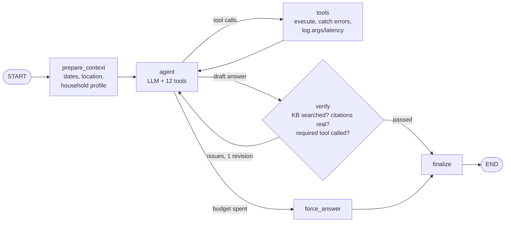

# EcoHome Energy Advisor

A LangGraph agent that analyses a smart home's energy data, live weather and time-of-use prices, and makes
**data-driven decisions**: when to charge the EV, how to set the thermostat around a price spike, when to run the
pool pump, and what each change saves in dollars, kWh and CO2. Every recommendation is grounded in tool output and
cites the knowledge base it drew on.

> **Evaluation results:** see [`reports/evaluation_report.md`](reports/evaluation_report.md), generated by
> `03_run_and_evaluate.ipynb`. The headline numbers are summarised in [Results](#results) below.

---

## Contents
1. [Rubric map](#rubric-map)
2. [Architecture](#architecture)
3. [Tools](#tools)
4. [Knowledge base and RAG](#knowledge-base-and-rag)
5. [Data](#data)
6. [Evaluation](#evaluation)
7. [Results](#results)
8. [Stand-out features](#stand-out-features)
9. [Setup and running](#setup-and-running)
10. [Environment: Python and package versions](#environment-python-and-package-versions)
11. [Starter defects fixed](#starter-defects-fixed)
12. [Limitations](#limitations)
13. [Project structure](#project-structure)

---

## Rubric map

| Rubric criterion | Where | What was done |
|---|---|---|
| Database set up; `EnergyUsage` and `SolarGeneration` tables | `01_db_setup.ipynb`, `models/energy.py` | Notebook creates and verifies both tables (plus `user_preferences`), fills 30 days of realistic data, and is safely re-runnable |
| Vector DB populated with comprehensive articles | `02_rag_setup.ipynb`, `data/documents/` | **11 documents** (2 starter + **9 added**) covering all five required topics plus EV charging, TOU rates, water heating and pools; 49 chunks in Chroma |
| `get_weather_forecast` | `tools.py`, `weather.py` | **Live Open-Meteo API** (free, no key) with geocoding; hourly irradiance converted to **estimated PV kWh** for the household's array; deterministic mock fallback |
| `get_electricity_prices` | `tools.py`, `energy_model.py` | Time-of-use tariff with off-peak / solar-midday / mid-peak / on-peak / **critical-peak event** periods; demand charge 0 off-peak; cheapest/most expensive hour summary |
| `search_energy_tips` (init if missing, load and split, else load, search, return dict) | `tools.py`, `rag.py` | All five steps, plus **hybrid dense+BM25 retrieval**, contextual chunk headers, diversity re-ranking and a **self-refreshing index** |
| Agent: LLM, Graph (schema, nodes, edges) | `agent.py` | Explicit `StateGraph` with a typed `EnergyAdvisorState` schema, six nodes (`prepare_context`, `agent`, `tools`, `verify`, `force_answer`, `finalize`) and conditional edges |
| Contract: `Agent(instructions, model)`, `invoke(question, context)` | `agent.py` | Both honoured; `invoke` also accepts `thread_id` for multi-turn memory |
| `ECOHOME_SYSTEM_PROMPT` (role, steps, capabilities, recommendation instructions, examples) | `03_run_and_evaluate.ipynb` §1 | ~1,200-word prompt with all five required parts, a tool-selection table, answer format and decision priorities |
| At least 10 test cases | `03_run_and_evaluate.ipynb` §2 | **18 cases** across 9 categories, including a personalisation case and an out-of-scope guardrail case |
| End-to-end workflow; decisions and tool usage logged in `test_results` | §1b and §3 | Step-by-step trace (context → decisions → tool calls → recommendation); `test_results` holds tool calls with args/status, the graph decision log, errors, LLM calls and latency; also saved to `reports/test_results.json`. **§3b proves that all 7 starter tools (including `get_recent_energy_summary` and `calculate_energy_savings`) ran successfully in `test_results`, and shows their outputs next to the recommendations they supported** |
| `evaluate_response()`: ACCURACY, RELEVANCE, COMPLETENESS, USEFULNESS + feedback | §4 | LLM judge (`gpt-4o`, structured output, anchored rubric, sees the tool evidence) + deterministic checks incl. **numeric grounding** |
| `evaluate_tool_usage()`: appropriateness, completeness + feedback | §4 | Also success rate, efficiency (duplicates/runaway loops) and argument validity; supports alternative tools (`a|b`) |
| `generate_evaluation_report()` + display function | §5 | Overall/per-metric/per-category/per-test scores, pass rate, latency, tool frequency, derived strengths, weaknesses and prioritised recommendations; `display_evaluation_report()` renders HTML + charts; saved as JSON and Markdown |
| Stand-out: visualisation | notebooks 01 and 03, `reports/figures/` | Load profiles vs solar and TOU windows, daily balance, cost by period, recommendation chart, savings projection, ML forecast, evaluation charts |
| Stand-out: personalisation | `user_preferences` table, `get_user_preferences` / `update_user_preference`, §6a | Household profile injected every turn; preferences learned mid-conversation persist; multi-turn memory via checkpointer |
| Stand-out: external APIs | `weather.py` | Live Open-Meteo forecast **and** real observed weather for the 30-day history |
| Stand-out: advanced RAG | `rag.py`, notebook 02 §7 | Hybrid retrieval with weighted RRF, measured on a 36-question retrieval benchmark |
| Stand-out: machine learning | `predict_energy_usage` | Per-device gradient boosting on hour/weekday/temperature, validated on a 7-day hold-out against a baseline |

---

## Architecture



| Node | Responsibility |
|---|---|
| `prepare_context` | **Context awareness.** Renders the current date/time, a date lookup for the next 8 days (so "Wednesday" maps to a real date), the caller's `context`, the usage-history range and the household profile/preferences, then injects them into the system prompt. |
| `agent` | The LLM (`gpt-4.1-mini`, temperature 0) with all tools bound. Transient API errors are retried with exponential back-off; a persistent failure becomes a polite message instead of an exception. |
| `tools` | Runs every tool call; unknown tools, validation errors and `{"error": ...}` results come back as `ToolMessage`s the model can recover from. Logs tool, args, status, latency and output size, and caps oversized outputs. |
| `verify` | **Quality gate.** If data tools were used: (1) the knowledge base must have been searched, and every cited `tip_*.txt` must be one the search returned; (2) **required-tool rules**: a savings question ("save", "pay off", payback, ROI) cannot be answered until `calculate_energy_savings` has run, and a recent-performance question ("last 24 hours", "today so far") needs `get_recent_energy_summary`, and a question about a past period ("yesterday", "last week") needs `query_energy_usage` and/or `query_solar_generation`. Otherwise the draft goes back with a specific critique (max two revisions). Rule (1) was added after gpt-4o-mini invented citations such as `tip_001.txt`; rule (2) after the first project review found savings answers released without the calculator. |
| `force_answer` | If the iteration budget (10 LLM calls) is spent, answers every pending tool call and asks for the best recommendation from evidence already gathered. |
| `finalize` | Records the final answer and a decision summary. |

**State schema (`EnergyAdvisorState`)**: `messages` (with the `add_messages` reducer), `question`, `context`,
`runtime_context`, `iterations`, `tool_log`, `decisions`, `errors`, `revisions`, `verification`, `final_answer`.
A `MemorySaver` checkpointer gives multi-turn memory per `thread_id`; per-question fields reset each turn.

**Model choice.** The starter default was `gpt-4o-mini`. In side-by-side runs of the same prompt, `gpt-4.1-mini`
followed the thermostat-setpoint and citation rules that `gpt-4o-mini` skipped, at a similar price, so it is the
default (`Agent(model=...)` or `ECOHOME_CHAT_MODEL` overrides it).

---

## Tools

| Tool | Purpose | Notes |
|---|---|---|
| `get_weather_forecast` | Hourly forecast with solar irradiance and **estimated PV output** | Live Open-Meteo; accepts `start_date` / weekday names; per-day summary with peak solar hours |
| `get_electricity_prices` | Hourly TOU rates, periods, demand charge, effective rate | Critical-peak event days (~1 weekday in 7); weekend peak billed as mid-peak; export credit |
| `search_energy_tips` | Hybrid RAG over the knowledge base | Returns source, title, section and scores for citation |
| `query_energy_usage` | Usage for a date range | Aggregated by device, device name, TOU period and day, plus an hourly profile; raw rows only on request |
| `query_solar_generation` | Solar history | Daily totals, best/worst day, by-weather yields, hourly profile |
| `get_recent_energy_summary` | Last N hours | Adds net balance, solar self-consumption and self-sufficiency |
| `calculate_energy_savings` | $, kWh, CO2, payback and ROI | Handles both efficiency and **load shifting** (different before/after prices); backward compatible |
| `optimize_device_schedule` | Cheapest start time for a flexible load | Scores every feasible window on prices plus the solar forecast; supports deadlines that wrap midnight; reports the unconstrained best window and savings vs. current habit |
| `analyze_usage_patterns` | Ranked savings opportunities from the household's own history | Per-device on-peak share and typical hours, with individual appliances (Dishwasher / Washing Machine / Dryer) broken out; solar self-consumption; $/month per opportunity |
| `predict_energy_usage` | ML forecast of a day's consumption and cost | Gradient boosting per device, weather-aware, hold-out validated |
| `get_user_preferences` / `update_user_preference` | Personalisation | Profile and learned preferences in SQLite |

All tools return JSON-serialisable dicts and never raise; dates accept `YYYY-MM-DD`, `today`, `tomorrow`,
`yesterday` or weekday names.

---

## Knowledge base and RAG

**Documents** (`data/documents/`): the two starter files plus nine added:
`tip_hvac_optimization`, `tip_smart_home_automation`, `tip_renewable_solar_integration`,
`tip_seasonal_energy_management`, `tip_energy_storage_optimization` (the five required topics),
`tip_ev_charging_strategies`, `tip_time_of_use_rates` (matches the tariff the pricing tool returns),
`tip_water_heating` and `tip_pool_spa_energy`. Figures follow U.S. DOE and ENERGY STAR guidance and are hedged where
sources vary.

**Pipeline** (`rag.py`):
1. Load every `.txt`/`.md` file (UTF-8), with title metadata.
2. Split on `## ` section boundaries first (900 chars, 150 overlap; the choice is justified by a chunk-size sweep in notebook 02).
3. Prefix each chunk with a **contextual header** `[Document title > Section]`.
4. Embed with `text-embedding-3-small` into Chroma (cosine).
5. Retrieve with **dense + BM25**, fuse with **weighted Reciprocal Rank Fusion** (dense 1.0, BM25 0.5), cap at two chunks per source.
6. A **manifest of document hashes** sits beside the index; adding or editing a document triggers an automatic rebuild.

**Measured, not assumed.** Notebook 02 benchmarks dense-only, BM25-only and hybrid retrieval on 36 labelled questions.
Dense is best on conversational phrasing, BM25 on exact terms (SEER2, NEM 3.0, V2H), and hybrid is the most robust
overall (Hit@1 0.89 vs 0.86 dense; MRR 0.93 vs 0.91). The benchmark also exposed a tokeniser bug (hyphens and trailing
periods), which was fixed.

---

## Data

`sample_data.py` generates 30 days plus today for a San Francisco home with a 7.2 kW PV array, a 13.5 kWh battery,
a Tesla Model 3, a heat pump, a pool pump and a heat-pump water heater, about 34 kWh/day in total.

- **Behavioural, not uniform.** EV charge sessions (65% start on arrival, on-peak), after-dinner dishwasher cycles,
  a 12:00-18:00 pool pump, and temperature-driven HVAC. These are the *un-optimised habits* that give the agent real
  savings to find.
- **Solar history from real weather.** Observed Open-Meteo irradiance and temperature for the last 30 days drive the
  same PV model the forecast tool uses.
- **Consistent costs.** Every `cost_usd` is `kWh x effective_rate` from the same tariff `get_electricity_prices` returns.

---

## Evaluation

`evaluate_response(question, final_response, expected_response, tool_outputs=None)`
- LLM judge: `gpt-4o`, a different model family from the agent, with Pydantic structured output. Scores 1-10 with
  written feedback for **accuracy, relevance, completeness, usefulness** and clarity, plus strengths, weaknesses and
  suggestions. The judge sees the tool evidence, so invented numbers are caught.
- Objective checks: specific times, $ and kWh figures, knowledge-base citations, actionable language, and a
  **numeric grounding ratio** (the share of stated $/kWh/°F/% figures that match a tool output within 2%).
- Weighted response score: accuracy .30, relevance .20, completeness .25, usefulness .25. A heuristic fallback
  runs if the judge is unavailable.

`evaluate_tool_usage(messages, expected_tools, acceptable_tools=None)`
- **Tool appropriateness** (share of calls that were sensible), **tool completeness** (share of expected tool groups
  satisfied; `a|b` alternatives allowed), success rate, efficiency (duplicate calls, runaway loops) and argument
  validity, with written feedback. Any tool call on an out-of-scope question counts as inappropriate.

`generate_evaluation_report()` then `display_evaluation_report()`
- Overall score (0.6 response + 0.4 tools), pass rate, per-metric mean/min/max, per-category and per-test tables,
  latency, tool frequency and error count.
- Strengths, weaknesses (including every failed test and why) and prioritised recommendations, derived from the metrics
  plus the judge's most frequent suggestions.
- Saved to `reports/evaluation_report.json` and `.md`, with charts in `reports/figures/`.

---

## Results

Final run after the first project review: agent `gpt-4.1-mini`, judge `gpt-4o`, 18 test cases, live weather.

| Metric | Value |
|---|---|
| Overall score (0.6 x response + 0.4 x tools) | **0.948** |
| Tests passed | **18 / 18** |
| Required tools exercised in `test_results` | **7 / 7** (§3b and the report's *Tool coverage* table) |
| Response quality: accuracy / relevance / completeness / usefulness / clarity | 9.2 / 9.9 / 8.9 / 9.2 / 9.4 (out of 10; lowest single score 7) |
| Tool appropriateness / completeness / success rate | 0.96 / 1.00 / 1.00 |
| Stated $/kWh/°F/% figures traced to tool outputs | 95% |
| Answers citing a knowledge-base file | 94% |
| Mean latency / mean tool calls per question | 13.6 s / 4.6 |

**Response to the first review** (it asked for all seven tools to be demonstrated, and for savings answers to call the
savings tools):
- **Required-tool rules in the `verify` node.** Savings questions cannot be finalised until `calculate_energy_savings`
  has run. Recent-performance questions need `get_recent_energy_summary`, and past-period questions need
  `query_energy_usage` / `query_solar_generation`. `dishwasher_offpeak`, `battery_roi` and `ev_shift_annual_savings`
  now all call `calculate_energy_savings`; `battery_roi`, which failed before for skipping it, now passes.
- **New scenarios.** `recent_24h_summary` and `solar_week_history` were added. `yesterday_summary` now expects both
  database tools.
- **Coverage check.** §3b asserts that every required tool ran successfully in `test_results` and prints its result
  beside the recommendation it supported. The report adds a *Tool coverage* table. Before these rules existed, this
  check failed a run in which the agent never called `query_solar_generation`, which is why coverage is now enforced
  by the graph rather than left to chance.
- **Calculator arguments.** `calculate_energy_savings` gained worked examples (appliance load shift, home battery). A
  smoke test had shown the model pricing a battery as extra consumption (`current_usage_kwh=0`).

**Earlier fixes found by the evaluation:** the dishwasher advice used the combined appliance total (the tool now
breaks out each appliance); a `numpy.float64` crashed the checkpointer (fixed, with a regression test);
gpt-4o-mini invented citations (hence the citation gate and the switch to gpt-4.1-mini). Across the full runs the
overall score was 0.89, 0.93, 0.93 and now 0.95.

Full details are in [`reports/evaluation_report.md`](reports/evaluation_report.md), the per-test log in
`reports/test_results.json`, and the charts in `reports/figures/`.

---

## Stand-out features

- **Visualisation**: hourly load vs. solar with TOU windows, daily balance, cost by period and device, the recommended
  EV window over tomorrow's price and solar curves, a 12-month savings projection, ML forecast charts, and evaluation
  charts. All saved in `reports/figures/`.
- **Personalisation**: the household profile is injected on every turn; stated preferences are saved with
  `update_user_preference` and used in later turns (§6a demonstrates a two-turn conversation).
- **External APIs**: live Open-Meteo forecast and geocoding, plus real observed weather for the history.
- **Advanced RAG**: hybrid retrieval, contextual chunk headers, diversity re-ranking, a self-refreshing index, and a
  retrieval benchmark.
- **Machine learning**: per-device gradient boosting forecasts with hold-out validation against a baseline.
- **Self-correction**: the `verify` quality-gate node.

---

## Setup and running

```powershell
# from the repository root (Windows PowerShell)
py -3.11 -m venv .venv
.\.venv\Scripts\python.exe -m pip install -r ecohome_solution\requirements.txt
.\.venv\Scripts\python.exe -m ipykernel install --user --name ecohome --display-name "EcoHome (.venv 3.11)"
copy ecohome_solution\.env.example ecohome_solution\.env   # then put your Vocareum key in it
```

`.env` keys: `VOCAREUM_API_KEY` (or `OPENAI_API_KEY`), and optionally `OPENAI_BASE_URL` (default
`https://openai.vocareum.com/v1`), `ECOHOME_CHAT_MODEL`, `ECOHOME_JUDGE_MODEL`, and `ECOHOME_OFFLINE=1` to skip the
weather API.

Run the notebooks in order with the `ecohome` kernel: `01_db_setup` → `02_rag_setup` → `03_run_and_evaluate`.
Notebook 03 makes about 18 agent runs plus 18 judge calls, which takes around 10 minutes.

> **About the saved outputs.** Every notebook output in this repository came from the Udacity Vocareum OpenAI
> gateway (`gpt-4.1-mini` agent, `gpt-4o` judge, `text-embedding-3-small` embeddings). The committed notebooks,
> database, vector store and reports can be read without any key. Re-running notebook 02 or 03 needs a `.env`
> created from `.env.example` with a valid key; the `.env` used here is git-ignored. Without a key, the offline test
> suite still runs, and notebook 01 still runs (weather needs no key).

**Tests** (offline: no API key or network needed; they use a scripted chat model, mock weather and hashing embeddings):

```powershell
cd ecohome_solution
..\.venv\Scripts\python.exe -m pytest -q
```

The 51 tests cover the energy model, every tool, the RAG index (including rebuild on new documents), and the agent
graph: the tool loop, error recovery, retries, the iteration budget, multi-turn memory and the quality gate, including its required-tool rules.

---

## Environment: Python and package versions

- **Python 3.11.9** (Windows 11), September 2026.
- Direct dependencies, pinned in `requirements.txt`:

| Package | Version | Package | Version |
|---|---|---|---|
| langgraph | 1.2.12 | chromadb | 1.5.9 |
| langchain-core | 1.6.5 | langchain-chroma | 1.1.0 |
| langchain-openai | 1.6.6 | langchain-text-splitters | 1.1.2 |
| openai | 3.19.2 | rank-bm25 | 0.2.2 |
| pydantic | 2.13.5 | SQLAlchemy | 2.1.1 |
| pandas | 3.0.6 | numpy | 2.4.6 |
| scikit-learn | 1.9.1 | matplotlib | 3.11.2 |
| httpx | 0.28.1 | python-dotenv | 1.2.3 |
| Jinja2 | 3.1.6 | ipykernel / nbconvert / pytest | 7.3.0 / 7.17.1 / 9.1.1 |

- The full `pip freeze` is in `requirements-lock.txt`.
- **Packages installed beyond the starter's list:** `rank-bm25` (hybrid retrieval), `scikit-learn` (usage forecast),
  `matplotlib` (charts), `langchain-text-splitters` (splitters moved out of `langchain` in 1.x), `Jinja2` (styled report
  tables) and `pytest`. `langchain-community` is no longer needed: its `TextLoader` was replaced by a plain UTF-8 read,
  because the package is being sunset and warns on import.

---

## Starter defects fixed

| Defect in the starter | Effect | Fix |
|---|---|---|
| `02_rag_setup` passed the literal string `"VOCAREUM_API_KEY"` as the API key | Embeddings fail with 401 | Key read from `.env` via `config.get_api_key()` |
| `search_energy_tips` indexed a hard-coded list of two files | Documents added after notebook 02 (the order the brief gives) were never searched | Index built from every file, plus a hash manifest that triggers rebuilds |
| `from langchain.text_splitter import ...` | `ImportError` on langchain 1.x | `langchain_text_splitters` |
| `query_energy_usage` returned every raw row | About 20k tokens per week of history sent to the LLM | Aggregates by default; raw rows on request, capped |
| Sample data recorded every device every hour (EV ~10 kWh/h) | ~340 kWh/day, so advice was meaningless | Behavioural device model, ~34 kWh/day |
| Notebook 01 appended on every run | Totals doubled on re-run | `reset_database()` first; bulk inserts |
| `get_recent_energy_summary` hard-coded `"sunny"` | Wrong weather label | Dominant observed condition |
| Records returned after the session closed could expire | `DetachedInstanceError` risk | `expire_on_commit=False` |
| Relative DB/vector-store paths depended on the working directory | Tools broke when imported from elsewhere | Paths anchored in `config.py` |
| `TextLoader` used the Windows default code page | `UnicodeDecodeError` on °F / ≈ | Explicit UTF-8 |
| `calculate_energy_savings` could not express load shifting | Shift savings always $0 | Separate before/after prices, frequency, CO2, payback |

---

## Limitations

- Prices come from a deterministic mock tariff modelled on California TOU plans, not a live utility API.
- The household is simulated. With live weather the history differs slightly between runs; offline it is fully
  deterministic.
- LLM-as-judge scores vary a little between runs; the objective checks and tool metrics are deterministic.
- The retrieval benchmark (36 questions) is small, so differences of one or two questions are noise.

---

## Project structure

```
ecohome_solution/
├── 01_db_setup.ipynb           # database + sample data + charts
├── 02_rag_setup.ipynb          # knowledge base, vector store, retrieval benchmark
├── 03_run_and_evaluate.ipynb   # system prompt, 18 tests, evaluation, report, stand-out demos
├── agent.py                    # LangGraph agent (schema, nodes, edges, quality gate)
├── tools.py                    # 12 tools
├── rag.py                      # hybrid retrieval pipeline
├── weather.py                  # Open-Meteo client + deterministic mock
├── energy_model.py             # tariff, solar geometry, PV model, household profile
├── sample_data.py              # behavioural usage + solar history generator
├── config.py                   # paths, models, API configuration
├── models/energy.py            # SQLAlchemy models + DatabaseManager
├── data/
│   ├── documents/              # 11 knowledge-base documents
│   ├── energy_data.db          # SQLite database (created by notebook 01)
│   └── vectorstore/            # Chroma index + manifest (created by notebook 02)
├── reports/                    # evaluation report (md/json), test_results.json, figures/
├── tests/                      # 51 offline pytest tests
├── requirements.txt            # pinned direct dependencies
├── requirements-lock.txt       # full pip freeze
└── .env.example
```
